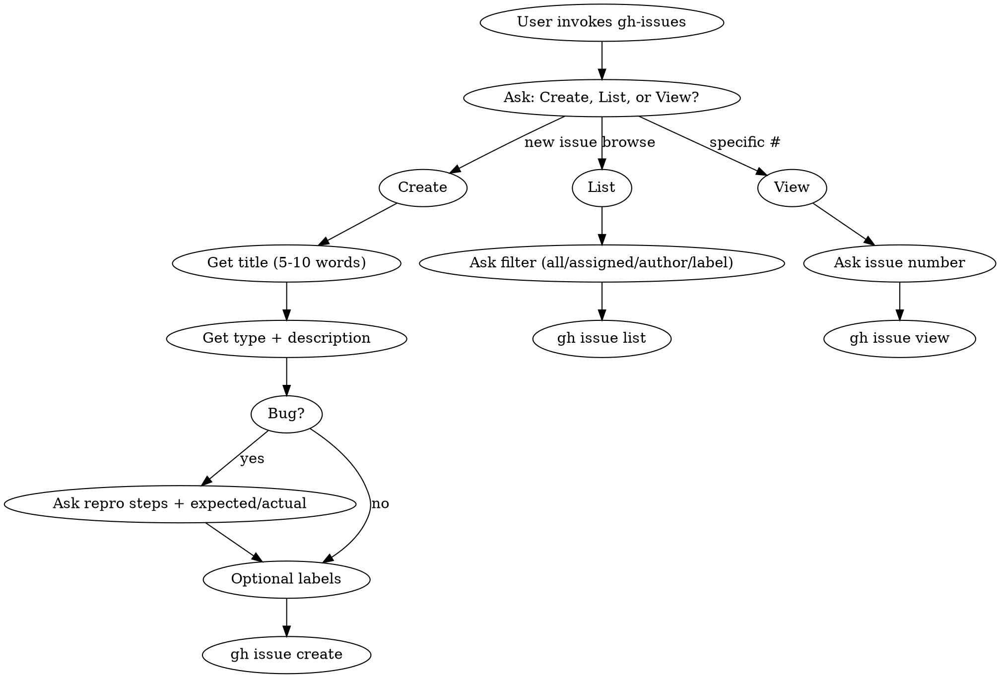

Create, list, or view GitHub issues using the `gh` CLI.

## Decision Flow



## Quick Reference

| Action | Command |
|--------|---------|
| Create | `gh issue create --title "..." --body "$(cat <<'EOF'`...`EOF``)"`|
| List all | `gh issue list` |
| List mine | `gh issue list --assignee @me` |
| List by author | `gh issue list --author @me` |
| List by label | `gh issue list --label "bug"` |
| View | `gh issue view 123` |
| Auth check | `gh auth status` |

## Workflow

### Step 1: Ask Action

Use AskUserQuestion with options: **Create new issue**, **List issues**, **View issue**

### Create Flow

1. **Get title** - Ask via AskUserQuestion. Enforce 5-10 words max. If user provides long title, shorten it and move details to body.
2. **Get type** - Bug / Enhancement / Feature / Task
3. **Get description** - Full details via "Other" input
4. **If Bug**: Ask for repro steps + expected vs actual behavior
5. **Optional labels** - multiSelect: bug, enhancement, documentation, good first issue
6. **Create with HEREDOC**:
```bash
gh issue create --title "Title" --body "$(cat <<'EOF'
## Description
[description]

## Steps to Reproduce  # (bugs only)
[steps]

## Expected / Actual   # (bugs only)
[behavior]
EOF
)"
```

### List Flow

Ask filter preference, then run appropriate command from Quick Reference table.

### View Flow

Ask issue number, run `gh issue view [number]`.

## Common Mistakes

| Mistake | Fix |
|---------|-----|
| Title too long | Move details to body. Titles are scannable headers, not summaries. |
| Not authenticated | Run `gh auth login` first |
| Not in repo | Must be in git repo with GitHub remote |
| Body formatting lost | Always use HEREDOC syntax to preserve newlines |

## Error Handling

If `gh` fails: check `gh auth status`, verify GitHub remote exists, report specific error.
