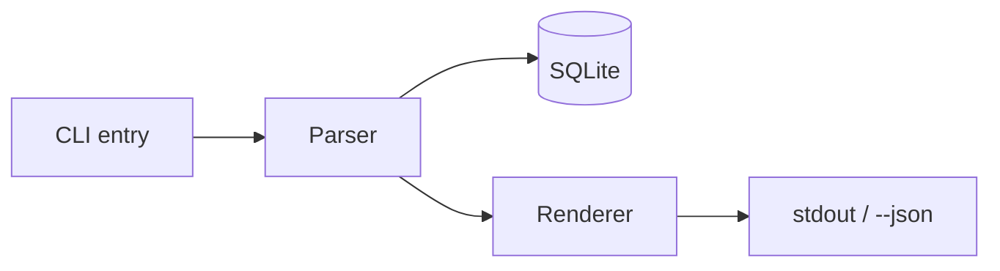

First, load the `writing-clearly-and-concisely` skill (if present) and apply it to every part of the plan.

Use the research and decisions already present in this conversation to create or revise a spec and phased implementation plan that an orchestrator can delegate without drifting. Treat `$ARGUMENTS` as optional additional direction. Do not discard or repeat research already completed in the current context.

Do not implement the project. Your deliverable is one plan artifact at `plans/<short-kebab-case-name>.md` in the repository root.

# Spec and phased plan

## Purpose

Write a right-sized spec: detailed enough to make scope, sequence, and completion unambiguous, but not so detailed that it pre-writes the implementation.

Prevent these common failures:

- Scope creep: require explicit non-goals.
- Ambiguous completion: require executable acceptance criteria for the project and every phase.
- Silent assumptions: tag guesses instead of inventing details.
- Monolithic delivery: create atomic, independently verifiable phases.
- Over-engineering: sketch only the simplest interfaces required by the acceptance criteria.
- Context loss: track each phase's status in the spec so a fresh agent can resume from the file alone.

## 0. Draft first

Use the conversation, repository, and your judgment to draft the plan without interviewing the user. You own the initial recommendations for goals, non-goals, acceptance criteria, and phase order; do not ask the user to author them.

Check the problem and user, success signal, hard constraints, and rough scope boundaries while drafting. Record reasonable, reversible assumptions under Constraints and Assumptions. State them directly or tag them `[ASSUMED: ...]`; do not ask the user to confirm each one.

Use `[NEEDS CLARIFICATION: ...]` only when the answer could materially change:

- Scope or architecture.
- Security or data handling.
- A public interface or irreversible decision.
- The ability to define credible acceptance criteria.

Ask before drafting only when no safe default exists and the answer would reshape the entire plan. Otherwise, finish the draft and ask at most three blocking questions afterward. Give a recommended default for every question so the user can reply, "defaults are fine."

## Editing an existing plan

If the request or `$ARGUMENTS` identifies an existing plan, edit that file instead of creating another. If the user asks to revise a plan but no path is clear, infer it only when one plan is unambiguous; otherwise ask for the path. Read the entire plan before proposing changes.

Treat phase status as an edit boundary:

- `[x] COMPLETE`: immutable history. Do not remove, rewrite, reorder, renumber, reopen, or alter its verification evidence.
- `[~] IN PROGRESS`: preserve its scope and order while implementation is active. Put new or changed scope in a later phase.
- `[ ] NOT STARTED`: may be removed, rewritten, split, combined, added, or reordered.

If a requested change would alter completed or active work, preserve the locked phase and create one or more pending follow-up phases instead. Explain the substitution in chat; do not ask the user to redesign it when a safe follow-up is clear.

Keep locked phase identifiers stable. Renumber pending phases only when doing so does not change a locked phase's identity or recorded references. Update pending dependencies, project acceptance criteria, architecture, and interface sketches to match the revised future work, but never rewrite the historical claim or evidence of a completed phase.

## Required document structure

Create one Markdown document with exactly these sections, in this order.

## 1. Problem statement

In two to four sentences, state what hurts, for whom, and why it matters now. Do not propose solutions here.

## 2. Goals

Recommend one to six outcomes from the available context. Each goal must be checkable at the end of the project. Do not ask the user to supply goals unless a missing decision would materially change the project.

- Bad: "Improve the API."
- Good: "Keep `/search` p95 latency below 200 ms under the documented benchmark."

## 3. Non-Goals

Recommend one to six plausible expectations that this project deliberately excludes. Give each a brief reason. This section is required and may not be empty. If the user supplied no exclusions, fill in reasonable non-goals from the context; do not ask the user to invent them.

Example: "No admin UI because the two internal operators can use the CLI."

## 4. Constraints and assumptions

Record the stack, environment, preserved interfaces, timeline, and other hard limits. Tag inferred constraints `[ASSUMED: ...]` and unresolved decisions `[NEEDS CLARIFICATION: ...]`.

## 5. Architecture sketch

Include this section, but add a Mermaid diagram only when the work has at least three interacting components, such as services, queues, external APIs, or distinct layers.

Keep diagrams high-level, with about five to twelve nodes. A single-module change or CRUD endpoint needs no diagram. If an honest diagram needs more than twelve nodes, split the project into a parent spec and smaller child specs.

Example:



## 6. Interface sketches

Show the solution's shape through load-bearing types, signatures, handlers, endpoints, and contracts. These sketches are normative but amendable: the implementation agent should follow them unless implementation reveals a problem, in which case it must update the spec first.

Rules:

- Write signatures and types, never implementation bodies. Use `// ...`, `TODO`, or an equivalent placeholder.
- Sketch only public boundaries, core data models, contracts shared across phases, and details that are easy to misunderstand.
- Use about 30 to 80 lines in total. Skip this section's code for small tasks when no interface sketch adds value.
- Use the repository's language. If the language is genuinely ambiguous, default to Go.
- Choose the simplest shape that satisfies the acceptance criteria.
- Do not add speculative abstractions, plugin systems, generic extension points, or interfaces with one implementation.

## 7. Project acceptance criteria

Recommend one to ten criteria based on the goals and repository. Prefer a runnable command followed by its exact expected result:

```text
AC-1: `npm test -- auth.test.ts` -> exit 0; the suite covers login, logout, and expired tokens
AC-2: `curl -s -o /dev/null -w "%{http_code}" localhost:3000/dashboard` without a cookie -> `302`
AC-3: `npm run build` -> exit 0 with no new type errors
```

Every criterion must be independently checkable by the orchestrator from the terminal. Inspect the repository to identify the appropriate commands instead of asking the user to write the criteria. If no test exists, require the relevant phase to create one. Use a manual check only when automation is impractical; then state exact steps and the expected observation.

Reject subjective criteria such as "the code is clean," "performance is good," or "the UI feels smooth."

## 8. Phased plan

Recommend one to six phases. Each phase must be:

- Atomic: it leaves the repository working and committable.
- Core-first: it proves the project's essential claim before ancillary work.
- Risk-aware: move a blocking library or external API spike into the earliest sensible phase.
- Orchestrator-verifiable: it ends with commands and expected results.

Use core-first order unless the user explicitly requires another order. Ask about ordering only when two viable sequences have materially different risks. Otherwise, state the recommended order without requesting confirmation.

Use this template for every phase:

```markdown
### Phase N: <name>
**Status:** [ ] NOT STARTED
<!-- [ ] NOT STARTED | [~] IN PROGRESS | [x] COMPLETE (date, verified by: <command and result>; code review: <result>) -->
**Outcome:** One sentence describing what this phase proves or delivers.
**Changes:**
- Deliverable
**Verification (orchestrator-owned):** Exact command(s), expected output, and expected exit code. Use a precise manual check only when no command is practical.
```

Add `Depends on`, `Out of scope`, or `Est. size` only when the information changes how an implementation agent should execute the phase.

### Status protocol

The spec file is the source of truth for progress.

- Every phase starts as `[ ] NOT STARTED`.
- Before delegation, the orchestrator gives each assigned builder the entire current phase verbatim plus the relevant goals, constraints, interfaces, acceptance criteria, assigned scope, exclusions, and repository state. For a mixed phase, every builder receives the same complete phase followed by its specific work unit.
- Before coding, the designated builder changes the phase to `[~] IN PROGRESS`. Commit that status separately only when parallel agents might duplicate work.
- Builders must not run tests, builds, linters, format checks, type checks, acceptance commands, or other verification. They may use LSP and must fix every diagnostic in changed code files.
- The orchestrator runs a focused work-unit check only when a multi-unit phase has a distinct command that provides useful early feedback. Otherwise, the phase's exact verification is the sole check. Never duplicate commands or coverage across work-unit and phase verification.
- After all phase work passes its exact verification, the orchestrator runs one code review over the complete phase commit range. Do not review individual implementation or fix commits.
- A designated builder may mark a phase `[x] COMPLETE` only after the orchestrator supplies current-session verification evidence and confirms that the phase-level code review has no unresolved findings. The builder records the evidence without rerunning verification.
- A completion record must include the date, command, result, and phase-review result, for example: `[x] COMPLETE (2026-07-19, verified by: npm test -- store.test.ts -> 14 passed; code review: no findings)`.
- An orchestrator resuming the project must read the full spec, find the earliest incomplete phase, and rerun the immediately preceding completed phase's acceptance check.
- If that regression check fails, the orchestrator must stop before new work and arrange repair of the failed phase before continuing.

## 9. Open questions

Collect only blocking `[NEEDS CLARIFICATION]` items so the user can answer in one pass. Include no more than three. If none remain, write `None.`

## Clarification and handoff

After writing the draft:

1. If Open Questions is non-empty, ask each blocking question directly in chat. Number the questions and suggest a default for each so the user can reply "defaults are fine" or answer selectively.
2. Fold the answers into the relevant sections, remove resolved tags, and restate anything still open.
3. Ask the user to choose a phase order only when viable sequences carry materially different risks. Otherwise, use the recommended core-first order.
4. If no blocking questions remain, report the artifact path and recommended phase order without requesting approval.
5. Do not implement the project or hand it to an implementation agent as part of this command.
6. Do not mark the plan ready for immediate work while a blocking `[NEEDS CLARIFICATION]` tag remains. Questions affecting only later phases may remain, but must be resolved before that phase becomes `[~] IN PROGRESS`.

## Right-sizing

- Small task, one file or less than about one day: use one or two phases. Keep the required section headings, but write `Not needed for this task.` under Architecture Sketch or Interface Sketches when they add no value.
- Medium feature, about one week: use the full template.
- Large, multi-week or multi-system project: create one parent spec whose phases point to focused child specs.
- Keep the spec within roughly one to three screens. Split oversized work instead of adding prose.
- Do not dictate variable names, internal file layout, or other choices the implementation agent can safely make.

## Refuse these anti-patterns

- A missing or empty Non-Goals section.
- Subjective or unverifiable acceptance criteria.
- "Phase 1: build everything; Phase 2: test everything." Each phase defines its own tests and orchestrator-run verification.
- Invented details hidden as facts rather than tagged assumptions or questions.
- Asking the user to supply goals, non-goals, acceptance criteria, or phase boundaries that the agent can reasonably recommend.
- Asking questions about reversible assumptions or low-impact preferences.
- Unasked clarification tags. Every tag must produce a chat question.
- Scope changes made in code before the spec is amended.
- Types, layers, configuration, or phases that do not trace to a goal or acceptance criterion.
- Interface sketches with implementation bodies.
- A completed phase whose acceptance check was not run by the orchestrator in the current session or whose phase-level code review has unresolved findings.
- Removing, rewriting, reordering, renumbering, or reopening a completed phase. Add a pending follow-up phase instead.
- Changing the scope or order of an active phase. Defer the change to a pending phase.
- Ancillary-first ordering without a documented constraint or material tradeoff.

## Output

For a new plan, write `plans/<short-kebab-case-name>.md` in the repository root, creating `plans/` if needed. For an existing plan, update it in place. Then run the clarification loop only when blocking questions remain. Report the artifact path, the recommended phase order, and any locked-phase request converted to follow-up work. Implementation belongs to a later command or agent.
