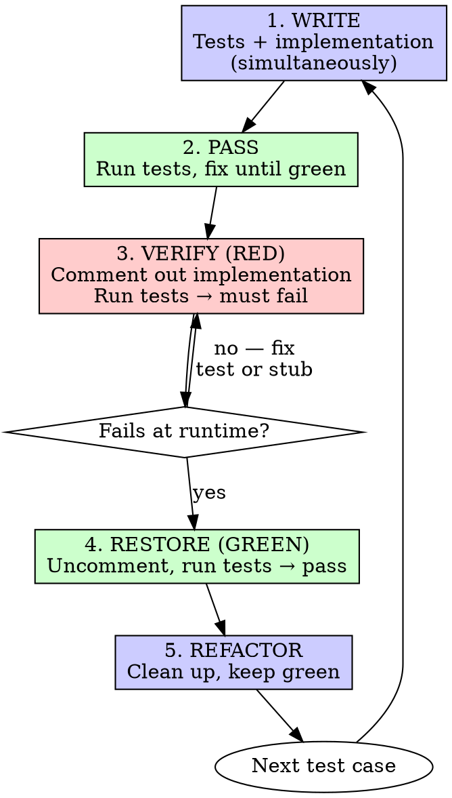

```dot
digraph bugfix_mode {
    rankdir=LR;
    red [label="1. RED\nWrite test\nreproducing bug", shape=box, style=filled, fillcolor="#ffcccc"];
    verify_red [label="Fails?", shape=diamond];
    green [label="2. GREEN\nFix the bug", shape=box, style=filled, fillcolor="#ccffcc"];
    verify_green [label="Passes?", shape=diamond];
    refactor [label="3. REFACTOR\nClean up", shape=box, style=filled, fillcolor="#ccccff"];

    red -> verify_red;
    verify_red -> green [label="yes"];
    verify_red -> red [label="no — fix test"];
    green -> verify_green;
    verify_green -> refactor [label="yes"];
    verify_green -> green [label="no — fix code"];
    refactor -> verify_green [label="stay green"];
}
```

# AI-Assisted Test-Driven Development (AI-TDD)

## Overview

**Core principle:** If you didn't watch the test fail, you don't know if it tests the right thing.

Unlike classic TDD, AI agents can write tests and implementation code simultaneously. However, you must verify every test actually fails when the implementation is removed. This prevents evergreen tests that pass regardless of implementation.

**A "bad failing test" is one that:**
- Doesn't compile (compile errors don't prove behavior)
- References a method that doesn't exist yet
- Fails for the wrong reason (setup error, not assertion failure)

**Good failing test:** Fails at runtime with an assertion error (`expected X, got Y`).

Two modes depending on the task:

- **Feature Mode** — New features, refactoring, behavior changes. Write tests and implementation together, then verify tests fail when implementation is removed.
- **Bug Fix Mode** — Bug fixes. The bug provides the natural failing state. Classic red-green-refactor.

## When to Use

**Always:**
- New features → Feature Mode
- Refactoring → Feature Mode
- Behavior changes → Feature Mode
- Bug fixes → Bug Fix Mode

**Exceptions (ask your human partner):**
- Throwaway prototypes
- Generated code
- Configuration files

Thinking "skip TDD just this once"? Stop. That's rationalization.

**Decision:** Is this a bug fix or a feature/refactoring/behavior change? The answer determines which flow to follow.

## The Iron Law

```
EVERY TEST MUST BE PROVEN TO FAIL
```

- **Bug fixes:** The bug makes the test fail naturally. Write the test, run it, watch it fail.
- **Features:** No natural failing state. Write tests and implementation together, then do a **Red-Green-Refactor verification pass**: comment out implementation, see it fail, restore it, see it pass.

Either way, every test must demonstrate it catches the problem it's designed to catch.

---

## Feature Mode

For new features, refactoring, and behavior changes.

Unlike classic TDD, you can write tests and implementation code simultaneously. After both are written, perform a **Red-Green-Refactor verification pass** to ensure tests actually validate the implementation.

### Flow



### Steps

#### 1. WRITE — Tests and Implementation (Simultaneously)

Write both the test and the implementation code together. Unlike classic TDD, you don't need to write the test first and watch it fail with compile errors. Write them both, then verify correctness in the next steps.

**Why:** AI agents can efficiently write coherent test-implementation pairs. The critical part is the verification pass that follows.

#### 2. PASS — Run Tests, Fix Until Green

```bash
go test ./...
```

Fix until all tests pass. This is your baseline.

#### 3. VERIFY (RED) — Comment Out Implementation

For each test case, comment out the related implementation code and run the tests.

**The test must fail at runtime.** Not a compile error, not an import error — a runtime assertion failure.

For compiled languages: leave stubs or zero values so code compiles but the test fails at runtime (see [Stub Patterns for Verification](#stub-patterns-for-verification)).

```bash
go test ./...
# FAIL: expected "success", got ""
```

**Test still passes?** The test doesn't actually test the implementation. Fix the test. This catches **evergreen tests** — tests that pass regardless of implementation.

**Compile error?** Add a stub return value so it compiles. The test must fail at the assertion (`expected X, got Y`), not the compiler. Compile errors don't prove behavior.

#### 4. RESTORE (GREEN) — Uncomment and Verify

Uncomment the implementation. Run tests. All green.

```bash
go test ./...
# PASS
```

#### 5. REFACTOR — Clean Up

After green only:
- Remove duplication
- Improve names
- Extract helpers

Keep tests green. Don't add behavior.

### Example

**WRITE** — Test and implementation:

```go
// retry_test.go
func TestRetryOperation(t *testing.T) {
    attempts := 0
    result, err := RetryOperation(func() (string, error) {
        attempts++
        if attempts < 3 {
            return "", errors.New("fail")
        }
        return "success", nil
    })

    assert.NoError(t, err)
    assert.Equal(t, "success", result)
    assert.Equal(t, 3, attempts)
}
```

```go
// retry.go
func RetryOperation[T any](fn func() (T, error)) (T, error) {
    var lastErr error
    for i := 0; i < 3; i++ {
        result, err := fn()
        if err == nil {
            return result, nil
        }
        lastErr = err
    }
    var zero T
    return zero, lastErr
}
```

**PASS** — `go test ./...` → all green.

**VERIFY (RED)** — Replace body with zero-value stub (must compile):

```go
func RetryOperation[T any](fn func() (T, error)) (T, error) {
    var zero T
    return zero, nil
}
```

`go test ./...` → fails: `expected "success", got ""`. Good — compiles, fails at runtime.

**RESTORE (GREEN)** — Restore implementation, run tests → pass.

---

## Bug Fix Mode

For bug fixes. The bug provides the natural failing state — no comment-out needed. This is traditional red-green-refactor.

**Important:** Always write the test FIRST, before any fix. The test must fail at runtime with an assertion error (`expected X, got Y`), not a compile error.

### Flow



### Steps

#### 1. RED — Write Test Reproducing the Bug (FIRST, before any fix)

**Write the test before touching the implementation.** This is non-negotiable.

Write a test that triggers the bug. Run it. It must fail at runtime with an assertion error.

```bash
go test ./...
# FAIL: expected "email required", got ""
```

**Test passes?** You haven't reproduced the bug. Fix the test.

**Compile error?** Add a stub return value so it compiles. The test must fail at the assertion, not the compiler.

**Wrong error type?** The test must fail with an assertion failure (`expected X, got Y`), not a setup error or exception.

#### 2. GREEN — Fix the Bug

Write the minimal fix. Run tests. They pass.

```bash
go test ./...
# PASS
```

**Test still fails?** Fix the code, not the test.

#### 3. REFACTOR — Clean Up

Clean up the fix. Keep tests green.

### Example

**Bug:** Empty email accepted by form validation.

**RED:** Write test first (add stub so it compiles):
```go
func TestValidateEmail_RejectsEmpty(t *testing.T) {
    err := ValidateEmail("")
    assert.Equal(t, "email required", err.Error())
}
```

```go
// Stub so test compiles (returns empty error, not nil)
func ValidateEmail(email string) error {
    return errors.New("")
}
```

```bash
$ go test ./...
FAIL: expected "email required", got ""
```

**GREEN:** Fix the bug:
```go
func ValidateEmail(email string) error {
    if strings.TrimSpace(email) == "" {
        return errors.New("email required")
    }
    return nil
}
```

```bash
$ go test ./...
PASS
```

**REFACTOR:** Extract validation helpers if needed.

---

## Stub Patterns for Verification

When commenting out implementation for Feature Mode verification, use zero-value stubs so code compiles but tests fail at runtime:

| Type | Stub Pattern |
|------|-------------|
| `T` (generic) | `var zero T; return zero, nil` |
| `error` | `return errors.New("")` or `nil` (whichever makes test fail) |
| `bool` | `return false` |
| `int` | `return 0` |
| `string` | `return ""` |
| `slice` | `return nil` |

The test must fail at the assertion (`expected X, got Y`), not at the compiler.

## Good Tests

| Quality | Good | Bad |
|---------|------|-----|
| **Minimal** | One thing. "and" in name? Split it. | `TestValidateEmail_DomainAndWhitespace()` |
| **Clear** | Name describes behavior | `TestValidateEmail()` |
| **Shows intent** | Demonstrates desired API | Obscures what code should do |

## Common Rationalizations

| Excuse | Reality |
|--------|---------|
| "Too simple to test" | Simple code breaks. Test takes 30 seconds. |
| "I'll verify it works by inspection" | Inspection doesn't prove the test catches failures. Comment-out does. |
| "Commenting out code is silly" | It takes 30 seconds and proves your test works. Skipping it proves nothing. |
| "Already manually tested" | Ad-hoc ≠ systematic. No record, can't re-run. |
| "Need to explore first" | Fine. Throw away exploration, start with TDD. |
| "Test hard = design unclear" | Listen to test. Hard to test = hard to use. |
| "TDD will slow me down" | TDD faster than debugging. Pragmatic = test-first. |
| "The compile error proves it" | Compile errors prove syntax, not behavior. Tests must fail at runtime with assertion errors. |
| "I wrote test and code together, no need to verify" | Skipping verification creates evergreen tests. Always do the Red-Green-Refactor pass. |
| "Existing code has no tests" | You're improving it. Add tests for the code you're changing. |

## Red Flags — STOP and Reassess

**Both modes:**
- Test passes on first run (never proven to fail)
- Can't explain why test failed
- Rationalizing "just this once"
- No tests for new behavior

**Feature Mode:**
- Skipped the comment-out verification step
- Test still passes with implementation commented out
- Compiler error instead of runtime failure during verification

**Bug Fix Mode:**
- Wrote the fix before writing the test (write test FIRST)
- Test was written after confirming the fix works (write test FIRST)
- Can't reproduce the bug in a test
- Test fails with compile error instead of assertion (add stub, make it compile)
- Test fails with wrong error (setup error instead of assertion failure)

**All of these mean: Stop. Go back to the correct step in the flow.**

## Verification Checklist

### Feature Mode

Before marking work complete:

- [ ] Every new function/method has a test
- [ ] All tests pass (GREEN baseline)
- [ ] Red-Green-Refactor verification pass completed for each test:
  - [ ] Commented out implementation (VERIFY RED)
  - [ ] Watched test fail at runtime with assertion error (not compile error)
  - [ ] Restored implementation and confirmed test passes (RESTORE GREEN)
- [ ] Tests use real code (mocks only if unavoidable)
- [ ] Edge cases and errors covered

### Bug Fix Mode

Before marking work complete:

- [ ] Wrote test reproducing the bug
- [ ] Watched test fail (RED — confirms bug is reproduced)
- [ ] Fixed the bug with minimal code
- [ ] All tests pass (GREEN)
- [ ] No other tests broken by the fix
- [ ] Tests use real code (mocks only if unavoidable)

Can't check all boxes? You skipped a step. Go back.

## When Stuck

| Problem | Solution |
|---------|----------|
| Don't know how to test | Write wished-for API. Write assertion first. Ask your human partner. |
| Test too complicated | Design too complicated. Simplify interface. |
| Must mock everything | Code too coupled. Use dependency injection. |
| Test setup huge | Extract helpers. Still complex? Simplify design. |

## Testing Anti-Patterns

When adding mocks or test utilities, read @testing-anti-patterns.md to avoid common pitfalls:
- Testing mock behavior instead of real behavior
- Adding test-only methods to production classes
- Mocking without understanding dependencies
