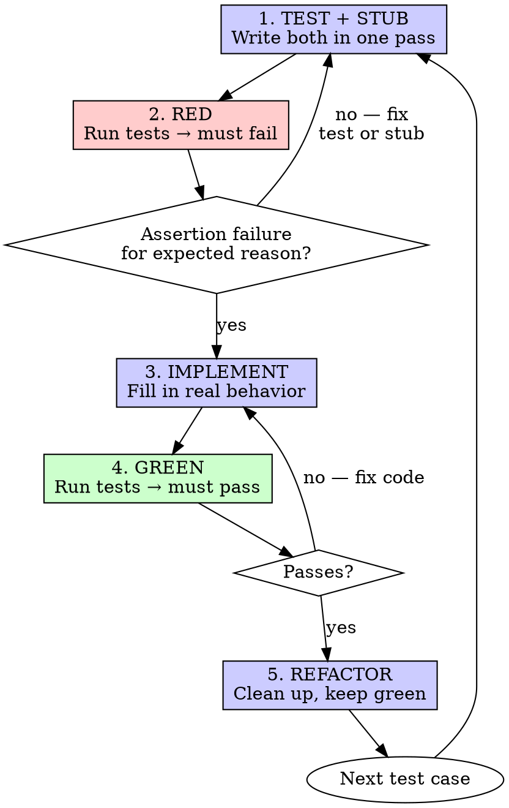

# AI-Assisted Test-Driven Development (AI-TDD)

## Overview

**Core principle:** If you didn't watch the test fail, you don't know if it tests the right thing.

AI agents can write tests and a compiling stub in the same pass. This avoids compile-only failures while preserving the essential TDD proof: the test fails before the requested behavior exists.

**A "bad failing test" is one that:**
- Doesn't compile (compile errors don't prove behavior)
- References a method that doesn't exist yet
- Fails for the wrong reason (setup error, not assertion failure)

**Good failing test:** Fails at runtime with an assertion error (`expected X, got Y`).

Two modes depending on the task:

- **Feature Mode** — New features, refactoring, behavior changes. Write tests and a behavior-free stub together, prove red, then add the real implementation.
- **Bug Fix Mode** — Bug fixes. The bug provides the natural failing state. Classic red-green-refactor.

## When to Use

**Always:**
- New features → Feature Mode
- Refactoring → Feature Mode
- Behavior changes → Feature Mode
- Bug fixes → Bug Fix Mode

**Exceptions (ask your human partner):**
- Throwaway prototypes
- Generated code
- Configuration files

Thinking "skip TDD just this once"? Stop. That's rationalization.

**Decision:** Is this a bug fix or a feature/refactoring/behavior change? The answer determines which flow to follow.

## The Iron Law

```
EVERY TEST MUST BE PROVEN TO FAIL
```

- **Bug fixes:** The bug makes the test fail naturally. Write the test, run it, watch it fail.
- **Features:** Write tests and a compiling, behavior-free stub in one pass. Run the tests and prove they fail at behavioral assertions before adding real behavior.

Either way, every test must demonstrate it catches the problem it's designed to catch.

---

## Feature Mode

For new features, refactoring, and behavior changes.

Write tests and the smallest compiling stub in one pass. Prove the tests fail for the expected behavioral reason, then fill in the real implementation.

### Flow


```dot
digraph feature_mode {
    rankdir=TB;
    write [label="1. TEST + STUB\nWrite both in one pass", shape=box, style=filled, fillcolor="#ccccff"];
    red [label="2. RED\nRun tests → must fail", shape=box, style=filled, fillcolor="#ffcccc"];
    check_red [label="Assertion failure\nfor expected reason?", shape=diamond];
    implement [label="3. IMPLEMENT\nFill in real behavior", shape=box, style=filled, fillcolor="#ccccff"];
    green [label="4. GREEN\nRun tests → must pass", shape=box, style=filled, fillcolor="#ccffcc"];
    check_green [label="Passes?", shape=diamond];
    refactor [label="5. REFACTOR\nClean up, keep green", shape=box, style=filled, fillcolor="#ccccff"];
    next [label="Next test case", shape=ellipse];

    write -> red;
    red -> check_red;
    check_red -> implement [label="yes"];
    check_red -> write [label="no — fix\ntest or stub"];
    implement -> green;
    green -> check_green;
    check_green -> refactor [label="yes"];
    check_green -> implement [label="no — fix code"];
    refactor -> next;
    next -> write;
}
```

### Steps

#### 1. TEST + STUB — Write Both in One Pass

Write the tests and the smallest production stub needed for them to compile and run. Do this in one edit pass, but put no requested behavior in the stub.

Choose stub outputs that are deliberately inconsistent with the test expectations. Do not blindly return a zero value when zero is a valid expected result.

If one stub cannot make every new test fail at the assertion level, split the work into smaller test-stub cycles. Each test still needs a proven red state.

**Why:** The stub avoids wasting the first run on missing symbols or compiler errors. Writing it with the tests is efficient, while withholding real behavior preserves the red-green proof.

If changing existing behavior and the current implementation already makes the new test fail correctly, use that as the red state. Do not replace working code with a synthetic stub.

#### 2. RED — Run Tests and Prove Failure

```bash
go test ./...
# FAIL: expected "success", got ""
```

**The test must fail at runtime.** Not a compile error, not an import error — a runtime assertion failure.

**Test passes?** The test or stub does not establish the missing behavior. Strengthen the test or choose a deliberately incorrect stub. This catches **evergreen tests** — tests that pass regardless of implementation.

**Compile error?** Complete the stub so the test reaches its assertion. Compile errors don't prove behavior.

**Wrong failure?** Fix the test setup or stub until the failure clearly describes the missing behavior.

#### 3. IMPLEMENT — Fill In Real Behavior

Only after observing the correct red state, replace the stub with the minimal implementation needed to satisfy the test.

Do not add speculative behavior. Let the tests drive what the implementation needs.

#### 4. GREEN — Run Tests and Verify

Run the targeted tests, then the broader relevant suite. All green.

```bash
go test ./...
# PASS
```

#### 5. REFACTOR — Clean Up

After green only:
- Remove duplication
- Improve names
- Extract helpers

Keep tests green. Don't add behavior.

### Example

**TEST + STUB** — Write the test and compiling stub in one pass:

```go
// retry_test.go
func TestRetryOperation(t *testing.T) {
    attempts := 0
    result, err := RetryOperation(func() (string, error) {
        attempts++
        if attempts < 3 {
            return "", errors.New("fail")
        }
        return "success", nil
    })

    assert.NoError(t, err)
    assert.Equal(t, "success", result)
    assert.Equal(t, 3, attempts)
}
```

```go
// retry.go
func RetryOperation[T any](fn func() (T, error)) (T, error) {
    var zero T
    return zero, nil
}
```

**RED** — Run the test before adding real behavior:

`go test ./...` → fails at an assertion because the result is not `"success"`. Good — it compiles and proves the behavior is missing.

**IMPLEMENT** — Fill in the real behavior:

```go
func RetryOperation[T any](fn func() (T, error)) (T, error) {
    var lastErr error
    for i := 0; i < 3; i++ {
        result, err := fn()
        if err == nil {
            return result, nil
        }
        lastErr = err
    }
    var zero T
    return zero, lastErr
}
```

**GREEN** — `go test ./...` → pass.

**REFACTOR** — Clean up only if needed, keeping the tests green.

---

## Bug Fix Mode

For bug fixes, the existing faulty behavior provides the natural failing state. This is traditional red-green-refactor.

**Important:** Always write the test FIRST, before any fix. The test must fail at runtime with an assertion error (`expected X, got Y`), not a compile error.

### Flow


```dot
digraph bugfix_mode {
    rankdir=LR;
    red [label="1. RED\nWrite test\nreproducing bug", shape=box, style=filled, fillcolor="#ffcccc"];
    verify_red [label="Fails?", shape=diamond];
    green [label="2. GREEN\nFix the bug", shape=box, style=filled, fillcolor="#ccffcc"];
    verify_green [label="Passes?", shape=diamond];
    refactor [label="3. REFACTOR\nClean up", shape=box, style=filled, fillcolor="#ccccff"];

    red -> verify_red;
    verify_red -> green [label="yes"];
    verify_red -> red [label="no — fix test"];
    green -> verify_green;
    verify_green -> refactor [label="yes"];
    verify_green -> green [label="no — fix code"];
    refactor -> verify_green [label="stay green"];
}
```

### Steps

#### 1. RED — Write Test Reproducing the Bug (FIRST, before any fix)

**Write the test before touching the implementation.** This is non-negotiable.

Write a test that triggers the bug. Run it. It must fail at runtime with an assertion error.

```bash
go test ./...
# FAIL: expected "email required", got ""
```

**Test passes?** You haven't reproduced the bug. Fix the test.

**Compile error?** If reproducing the bug requires new API surface, add only enough stub code to compile. The test must fail at the assertion, not the compiler.

**Wrong error type?** The test must fail with an assertion failure (`expected X, got Y`), not a setup error or exception.

#### 2. GREEN — Fix the Bug

Write the minimal fix. Run tests. They pass.

```bash
go test ./...
# PASS
```

**Test still fails?** Fix the code, not the test.

#### 3. REFACTOR — Clean Up

Clean up the fix. Keep tests green.

### Example

**Bug:** Empty email accepted by form validation.

**Existing faulty implementation:**

```go
func ValidateEmail(email string) error {
    return nil
}
```

**RED:** Write the regression test before changing the implementation:

```go
func TestValidateEmail_RejectsEmpty(t *testing.T) {
    err := ValidateEmail("")
    assert.EqualError(t, err, "email required")
}
```

```bash
$ go test ./...
FAIL: expected error "email required", got nil
```

**GREEN:** Fix the bug:
```go
func ValidateEmail(email string) error {
    if strings.TrimSpace(email) == "" {
        return errors.New("email required")
    }
    return nil
}
```

```bash
$ go test ./...
PASS
```

**REFACTOR:** Extract validation helpers if needed.

---

## Stub Patterns for Initial Red

Use a minimal, type-correct stub so tests compile and reach behavioral assertions before real implementation begins. Pick a value that is guaranteed to contradict the current test expectation:

| Type | Stub Pattern |
|------|-------------|
| `T` (generic) | Return a test-specific sentinel, or a zero value only when zero is not expected |
| `error` | Return `nil` when an error is expected; return a sentinel error when success is expected |
| `bool` | Return the opposite of the current expected value |
| `int` | Return an out-of-domain sentinel such as `-1`, when valid for the type |
| `string` | Return an unmistakable sentinel such as `"not implemented"` |
| `slice` | Return `nil` or a sentinel element, whichever contradicts the expectation |
| Side effect | Do nothing when the test expects an observable effect |

If the same stub would satisfy another test, use a different sentinel or split the tests into smaller cycles. The test must fail at the assertion (`expected X, got Y`), not at the compiler.

## Good Tests

| Quality | Good | Bad |
|---------|------|-----|
| **Public interface only** | Tests public API, black-box behavior | Tests private methods or internal types |
| **Minimal** | One thing. "and" in name? Split it. | `TestValidateEmail_DomainAndWhitespace()` |
| **Clear** | Name describes behavior | `TestValidateEmail()` |
| **Shows intent** | Demonstrates desired API | Obscures what code should do |

### Test Only Public Interfaces

**All tests must go through the public API.** Never test private methods, private state, or internal types directly — even if those types have public methods.

```typescript
// ❌ WRONG: Testing internal implementation
const service = new UserService();
expect((service as any).validateEmail('bad')).toBe(false);  // private method!

// ❌ WRONG: Testing internal type directly
const validator = new TokenValidator();  // internal type, not public API
expect(validator.validate('token')).toBe(true);

// ✅ RIGHT: Testing through public interface
const service = new UserService();
expect(() => service.createUser('bad', 'name')).toThrow('Invalid email');
```

**Why:** Private methods and internal types are implementation details. Testing them couples your tests to internal structure, making refactoring impossible. The public API is the contract — test that.

## Common Rationalizations

| Excuse | Reality |
|--------|---------|
| "Too simple to test" | Simple code breaks. Test takes 30 seconds. |
| "I'll verify it works by inspection" | Inspection doesn't prove the test catches missing behavior. The initial red run does. |
| "The stub is wasted work" | A tiny stub avoids compiler-only failures and proves the test before behavior is added. |
| "Already manually tested" | Ad-hoc ≠ systematic. No record, can't re-run. |
| "Need to explore first" | Fine. Throw away exploration, start with TDD. |
| "Test hard = design unclear" | Listen to test. Hard to test = hard to use. |
| "TDD will slow me down" | TDD faster than debugging. Pragmatic = test-first. |
| "The compile error proves it" | Compile errors prove syntax, not behavior. Tests must fail at runtime with assertion errors. |
| "I'll write the test and real behavior together" | That skips red. The first pass contains tests and a behavior-free stub only. |
| "Existing code has no tests" | You're improving it. Add tests for the code you're changing. |

## Red Flags — STOP and Reassess

**Both modes:**
- Test passes on first run (never proven to fail)
- Can't explain why test failed
- Rationalizing "just this once"
- No tests for new behavior

**Feature Mode:**
- Added real behavior before observing the initial red state
- A new test passes against the behavior-free stub
- Compiler or setup error instead of a behavioral assertion failure
- Replaced completed behavior with a stub after reaching green

**Bug Fix Mode:**
- Wrote the fix before writing the test (write test FIRST)
- Test was written after confirming the fix works (write test FIRST)
- Can't reproduce the bug in a test
- Test fails with compile error instead of assertion (add stub, make it compile)
- Test fails with wrong error (setup error instead of assertion failure)

**All of these mean: Stop. Go back to the correct step in the flow.**

## Verification Checklist

### Feature Mode

Before marking work complete:

- [ ] Every new function/method has a test
- [ ] Tests and a behavior-free compiling stub were written in one pass
- [ ] Every new test was observed failing at a behavioral assertion
- [ ] Real implementation began only after the correct red state
- [ ] Targeted tests and the broader relevant suite pass
- [ ] Tests use real code (mocks only if unavoidable)
- [ ] Edge cases and errors covered

### Bug Fix Mode

Before marking work complete:

- [ ] Wrote test reproducing the bug
- [ ] Watched test fail (RED — confirms bug is reproduced)
- [ ] Fixed the bug with minimal code
- [ ] All tests pass (GREEN)
- [ ] No other tests broken by the fix
- [ ] Tests use real code (mocks only if unavoidable)

Can't check all boxes? You skipped a step. Go back.

## When Stuck

| Problem | Solution |
|---------|----------|
| Don't know how to test | Write wished-for API. Write assertion first. Ask your human partner. |
| Test too complicated | Design too complicated. Simplify interface. |
| Must mock everything | Code too coupled. Use dependency injection. |
| Test setup huge | Extract helpers. Still complex? Simplify design. |

## Testing Anti-Patterns

When adding mocks or test utilities, read @testing-anti-patterns.md to avoid common pitfalls:
- Testing private methods or internal types directly (always test through public interfaces)
- Testing mock behavior instead of real behavior
- Adding test-only methods to production classes
- Mocking without understanding dependencies
