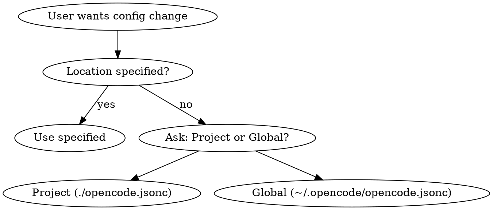

Configure OpenCode behavior via `opencode.jsonc`. Supports JSONC (comments and trailing commas allowed). Schema at `https://opencode.ai/config.json`.

## Config Locations

| Location | File Path |
|----------|-----------|
| Project | `./opencode.jsonc` (repo root) |
| Global | `~/.opencode/opencode.jsonc` |

## Decision Flow



## Quick Reference

| Goal | Config Pattern |
|------|----------------|
| Change model | `"model": "provider/model-name"` |
| Disable sharing | `"share": "disabled"` (disabled/enabled/private) |
| Auto-update | `"autoupdate": "notify"` (notify/enable/disable) |
| Set default agent | `"default_agent": "plan"` |
| Allow bash command | `"bash": { "make test": "allow" }` |
| Block env files | `"read": { "*.env": "deny" }` |
| Whitelist skill | `"skill": { "docx": "allow" }` |
| Allow task type | `"task": { "explore": "allow" }` |
| Add MCP server | `"mcp": { "name": { "type": "remote", "url": "..." } }` |

## Permission Values

- `"allow"` - Execute without asking
- `"deny"` - Never execute
- `"ask"` - Prompt user each time

## Permission Categories

```jsonc
{
  "permission": {
    "read": {          // File patterns: "*.env": "deny"
      "*": "allow",
      "*.env": "deny"
    },
    "edit": "allow",   // Tool-level
    "bash": {          // Command patterns
      "*": "ask",
      "make test": "allow"
    },
    "skill": {         // By skill name
      "*": "ask",
      "docx": "allow"
    },
    "task": {          // By subagent type
      "*": "ask",
      "explore": "allow"
    },
    "webfetch": "ask",
    "websearch": "ask"
  }
}
```

## Workflow

1. **Ask location** if not specified: Project or Global?
2. **Check existence** - Read existing config if present
3. **Ask what to modify** (or use provided requirements)
4. **Apply changes** - Preserve existing settings
5. **Show diff** and confirm save

## Common Patterns

### Add Multiple Bash Commands

```jsonc
"bash": {
  "*": "ask",
  "make *": "allow",
  "go test *": "allow",
  "git status *": "allow"
}
```

### Whitelist Skills

```jsonc
"skill": {
  "*": "ask",
  "docx": "allow",
  "pdf": "allow",
  "xlsx": "allow"
}
```

### Protect Sensitive Files

```jsonc
"read": {
  "*": "allow",
  "*.env": "deny",
  "*.env.*": "deny",
  "*.env.example": "allow"
}
```

### MCP Server Setup

```jsonc
"mcp": {
  "context7": {
    "type": "remote",
    "url": "https://mcp.context7.com/mcp",
    "enabled": false
  }
}
```

## Common Mistakes

| Mistake | Fix |
|---------|-----|
| Wrong location | Check if user wants project or global config |
| Syntax errors | Validate JSONC - check braces, commas, quotes |
| Invalid values | Only `"allow"`, `"deny"`, `"ask"` are valid |
| Pattern escaping | Quote patterns with special chars: `"git *": "allow"` |
| Forgetting wildcards | `"make test"` matches exact, `"make *"` matches all make commands |
