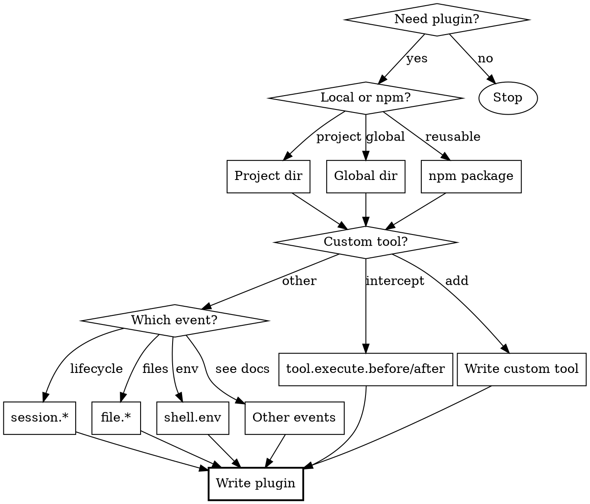

# Creating OpenCode Plugins

## Overview

OpenCode plugins are JavaScript/TypeScript modules that hook into events to extend or customize behavior. Plugins receive a context object and return hooks that subscribe to events like tool execution, file edits, and session lifecycle.

Core principle: Plugins intercept events and modify behavior through hook handlers.

## When to Use

**Use when you need to:**
- Add custom tools beyond built-in bash/read/edit
- Hook into events (file changes, tool execution, sessions)
- Modify default behavior (block .env reads, inject env vars)
- Add integrations (notifications, logging, external services)
- Customize session compaction prompts

**Don't use for:**
- One-off scripts (use bash tool instead)
- Simple aliases (use shell configuration)
- Project-specific conventions (put in AGENTS.md)

## Decision Flowchart



## Quick Reference

| Task | Location | Notes |
|------|----------|-------|
| Project plugin | `.opencode/plugins/*.js` | Auto-loaded for this project only |
| Global plugin | `~/.config/opencode/plugins/*.js` | Auto-loaded for all projects |
| npm plugin | Add to `opencode.json` plugins array | Auto-installed via Bun |
| Dependencies | `package.json` in config dir | Bun install at startup |
| TypeScript types | `import type { Plugin } from "@opencode-ai/plugin"` | Optional but recommended |

**Load order:** Global config → Project config → Global plugins → Project plugins

## Plugin Structure

### Basic JavaScript Plugin

```javascript
// .opencode/plugins/example.js
export const MyPlugin = async ({ project, client, $, directory, worktree }) => {
  console.log("Plugin initialized!")
  
  return {
    "tool.execute.before": async (input, output) => {
      // Hook logic here
    }
  }
}
```

### TypeScript Plugin with Types

```typescript
// .opencode/plugins/example.ts
import type { Plugin } from "@opencode-ai/plugin"

export const MyPlugin: Plugin = async ({ project, client, $, directory, worktree }) => {
  return {
    "tool.execute.before": async (input, output) => {
      // Type-safe hook implementation
    }
  }
}
```

### Context Object

The plugin function receives:

| Property | Type | Description |
|----------|------|-------------|
| `project` | Object | Current project information |
| `directory` | string | Current working directory |
| `worktree` | string | Git worktree path |
| `client` | SDKClient | OpenCode SDK client for AI interaction |
| `$` | BunShell | Bun's shell API for command execution |

## Available Events

### Tool Events
- `tool.execute.before` - Before tool execution (can modify args or block)
- `tool.execute.after` - After tool execution (can modify output)

### Session Events
- `session.created` - New session started
- `session.compacted` - Context was compacted
- `session.idle` - Session completed, waiting for input
- `session.updated` - Session state changed
- `experimental.session.compacting` - Before compaction (customize prompt)

### File Events
- `file.edited` - File was modified
- `file.watcher.updated` - File watcher detected change

### Shell Events
- `shell.env` - Inject environment variables into shell/tool execution

### Other Events
- `command.executed` - CLI command executed
- `permission.asked/replied` - Permission flow
- `message.*` - Message lifecycle
- `todo.updated` - Todo list changed
- `lsp.*` - LSP server events
- `server.connected` - Server connection

## Implementation Examples

### Example 1: Send Notifications

Send macOS notification when session completes:

```javascript
// .opencode/plugins/notification.js
export const NotificationPlugin = async ({ $ }) => {
  return {
    "session.idle": async () => {
      await $`osascript -e 'display notification "Session completed!" with title "opencode"'`
    }
  }
}
```

### Example 2: .env Protection

Block reading .env files:

```javascript
// .opencode/plugins/env-protection.js
export const EnvProtection = async () => {
  return {
    "tool.execute.before": async (input, output) => {
      if (input.tool === "read" && output.args.filePath.includes(".env")) {
        throw new Error("Do not read .env files")
      }
    }
  }
}
```

### Example 3: Inject Environment Variables

Add env vars to all shell/tool execution:

```javascript
// .opencode/plugins/inject-env.js
export const InjectEnvPlugin = async () => {
  return {
    "shell.env": async (input, output) => {
      output.env.MY_API_KEY = process.env.MY_API_KEY
      output.env.PROJECT_ROOT = input.cwd
    }
  }
}
```

### Example 4: Custom Tool

Add a custom tool opencode can call:

```typescript
// .opencode/plugins/custom-tools.ts
import { type Plugin, tool } from "@opencode-ai/plugin"

export const CustomToolsPlugin: Plugin = async () => {
  return {
    tool: {
      fetchUser: tool({
        description: "Fetch user data from API",
        args: {
          userId: tool.schema.string(),
        },
        async execute(args, context) {
          const { directory } = context
          // Implementation here
          return `Fetched user ${args.userId}`
        }
      })
    }
  }
}
```

### Example 5: Structured Logging

Use SDK client for logging:

```typescript
// .opencode/plugins/logging.ts
export const LoggingPlugin = async ({ client }) => {
  await client.app.log({
    body: {
      service: "my-plugin",
      level: "info",
      message: "Plugin initialized"
    }
  })
}
```

### Example 6: Compaction Hooks

Customize session compaction:

```typescript
// .opencode/plugins/compaction.ts
import type { Plugin } from "@opencode-ai/plugin"

export const CompactionPlugin: Plugin = async () => {
  return {
    "experimental.session.compacting": async (input, output) => {
      output.context.push(`## Current Task
Task: Implementing user authentication
Active files: src/auth.ts, src/middleware.ts`)
    }
  }
}
```

## Dependencies

For external npm packages, create a `package.json` in your config directory:

```json
// .opencode/package.json
{
  "dependencies": {
    "shescape": "^2.1.0"
  }
}
```

Then import in your plugin:

```javascript
import { escape } from "shescape"

export const MyPlugin = async () => {
  return {
    "tool.execute.before": async (input, output) => {
      if (input.tool === "bash") {
        output.args.command = escape(output.args.command)
      }
    }
  }
}
```

OpenCode runs `bun install` at startup to install these.

## Common Mistakes

| Mistake | Fix |
|---------|-----|
| Plugin not loading | Check file extension (.js/.ts) and export name |
| Dependencies not found | Add package.json to `.opencode/` dir, not plugins/ dir |
| Tool override not working | Plugin tools take precedence, verify name matches |
| Event not firing | Check exact event name (case-sensitive) |
| Async issues | All hook handlers must be async functions |
| Missing types | Install `@opencode-ai/plugin` for TypeScript support |
| Console.log not visible | Use `client.app.log()` for structured logging |

## Red Flags

**Stop and reassess if:**
- Plugin logic could be a simple bash command
- You're hooking events just to log (use client.app.log instead)
- Plugin modifies behavior in unexpected ways (document clearly)
- Tool overrides don't explain what they do differently

## Best Practices

1. **Export name matters**: Use descriptive names like `EnvProtection`, not `plugin`
2. **Handle errors gracefully**: Throw clear error messages in hooks
3. **Document side effects**: If you block/modify behavior, say why
4. **Test hooks independently**: Verify each hook works in isolation
5. **Use TypeScript**: Types catch errors early
6. **Keep it focused**: One plugin, one responsibility

## Resources

- Full plugin docs: https://opencode.ai/docs/plugins/
- SDK reference: https://opencode.ai/docs/sdk/
- Community plugins: https://opencode.ai/docs/ecosystem#plugins
