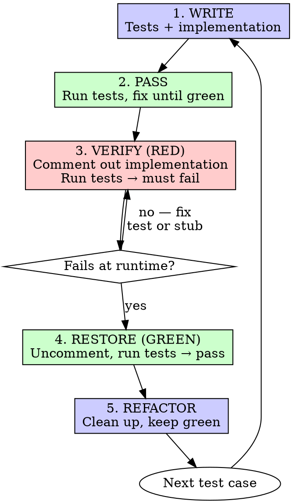

```dot
digraph bugfix_mode {
    rankdir=LR;
    red [label="1. RED\nWrite test\nreproducing bug", shape=box, style=filled, fillcolor="#ffcccc"];
    verify_red [label="Fails?", shape=diamond];
    green [label="2. GREEN\nFix the bug", shape=box, style=filled, fillcolor="#ccffcc"];
    verify_green [label="Passes?", shape=diamond];
    refactor [label="3. REFACTOR\nClean up", shape=box, style=filled, fillcolor="#ccccff"];

    red -> verify_red;
    verify_red -> green [label="yes"];
    verify_red -> red [label="no — fix test"];
    green -> verify_green;
    verify_green -> refactor [label="yes"];
    verify_green -> green [label="no — fix code"];
    refactor -> verify_green [label="stay green"];
}
```

# Test-Driven Development (TDD)

## Overview

**Core principle:** If you didn't watch the test fail, you don't know if it tests the right thing.

Two modes depending on the task:

- **Feature Mode** — New features, refactoring, behavior changes. Write tests and implementation together, then verify tests fail when implementation is removed.
- **Bug Fix Mode** — Bug fixes. The bug provides the natural failing state. Classic red-green-refactor.

## When to Use

**Always:**
- New features → Feature Mode
- Refactoring → Feature Mode
- Behavior changes → Feature Mode
- Bug fixes → Bug Fix Mode

**Exceptions (ask your human partner):**
- Throwaway prototypes
- Generated code
- Configuration files

Thinking "skip TDD just this once"? Stop. That's rationalization.

**Decision:** Is this a bug fix or a feature/refactoring/behavior change? The answer determines which flow to follow.

## The Iron Law

```
EVERY TEST MUST BE PROVEN TO FAIL
```

- **Bug fixes:** The bug makes the test fail naturally. Write the test, run it, watch it fail.
- **Features:** No natural failing state. Write tests and implementation, then comment out implementation to prove each test fails without it.

Either way, every test must demonstrate it catches the problem it's designed to catch.

---

## Feature Mode

For new features, refactoring, and behavior changes.

There's no natural failing state — the code doesn't exist yet or you're changing existing behavior. Write tests and implementation together, then verify via comment-out.

### Flow



### Steps

#### 1. WRITE — Tests and Implementation

Write both the test and the implementation code. Any order is fine — you'll verify correctness in the next steps.

#### 2. PASS — Run Tests, Fix Until Green

```bash
npm test path/to/test.test.ts  # or equivalent
```

Fix until all tests pass. This is your baseline.

#### 3. VERIFY (RED) — Comment Out Implementation

For each test case, comment out the related implementation code and run the tests.

**The test must fail at runtime.** Not a compile error, not an import error — a runtime assertion failure.

For compiled languages: leave stubs or zero values so code compiles but the test fails at runtime (see [Compiled Languages](#compiled-languages)).

```bash
npm test path/to/test.test.ts
# FAIL: Expected 'success', received undefined
```

**Test still passes?** The test doesn't actually test the implementation. Fix the test.

**Compile error?** Add a stub return value so it compiles. The test must fail at the assertion, not the compiler.

#### 4. RESTORE (GREEN) — Uncomment and Verify

Uncomment the implementation. Run tests. All green.

```bash
npm test path/to/test.test.ts
# PASS
```

#### 5. REFACTOR — Clean Up

After green only:
- Remove duplication
- Improve names
- Extract helpers

Keep tests green. Don't add behavior.

### TypeScript Example

**WRITE** — Test and implementation together:

```typescript
// retry.test.ts
test('retries failed operations 3 times', async () => {
  let attempts = 0;
  const operation = () => {
    attempts++;
    if (attempts < 3) throw new Error('fail');
    return 'success';
  };

  const result = await retryOperation(operation);

  expect(result).toBe('success');
  expect(attempts).toBe(3);
});
```

```typescript
// retry.ts
async function retryOperation<T>(fn: () => T): Promise<T> {
  for (let i = 0; i < 3; i++) {
    try {
      return fn();
    } catch (e) {
      if (i === 2) throw e;
    }
  }
  throw new Error('unreachable');
}
```

**PASS** — Run tests, all green.

**VERIFY (RED)** — Comment out the retry loop:

```typescript
async function retryOperation<T>(fn: () => T): Promise<T> {
  // for (let i = 0; i < 3; i++) {
  //   try {
  //     return fn();
  //   } catch (e) {
  //     if (i === 2) throw e;
  //   }
  // }
  return undefined as T;
}
```

Run tests → fails: `Expected 'success', received undefined`. Good — test catches missing implementation.

**RESTORE (GREEN)** — Uncomment, run tests → pass.

### Go Example

**WRITE** — Test and implementation:

```go
// retry_test.go
func TestRetryOperation(t *testing.T) {
    attempts := 0
    result, err := RetryOperation(func() (string, error) {
        attempts++
        if attempts < 3 {
            return "", errors.New("fail")
        }
        return "success", nil
    })

    assert.NoError(t, err)
    assert.Equal(t, "success", result)
    assert.Equal(t, 3, attempts)
}
```

```go
// retry.go
func RetryOperation[T any](fn func() (T, error)) (T, error) {
    var lastErr error
    for i := 0; i < 3; i++ {
        result, err := fn()
        if err == nil {
            return result, nil
        }
        lastErr = err
    }
    var zero T
    return zero, lastErr
}
```

**PASS** — `go test ./...` → all green.

**VERIFY (RED)** — Replace body with zero-value stub (must compile):

```go
func RetryOperation[T any](fn func() (T, error)) (T, error) {
    var zero T
    return zero, nil
}
```

`go test ./...` → fails: `expected "success", got ""`. Good — compiles, fails at runtime.

**RESTORE (GREEN)** — Restore implementation, run tests → pass.

---

## Bug Fix Mode

For bug fixes. The bug provides the natural failing state — no comment-out needed. This is traditional red-green-refactor.

### Flow



### Steps

#### 1. RED — Write Test Reproducing the Bug

Write a test that triggers the bug. Run it. It must fail.

```bash
npm test path/to/test.test.ts
# FAIL: expected 'Email required', got undefined
```

**Test passes?** You haven't reproduced the bug. Fix the test.

#### 2. GREEN — Fix the Bug

Write the minimal fix. Run tests. They pass.

```bash
npm test path/to/test.test.ts
# PASS
```

**Test still fails?** Fix the code, not the test.

#### 3. REFACTOR — Clean Up

Clean up the fix. Keep tests green.

### Example: Empty Email Accepted

**Bug:** Empty email accepted by form.

**RED:**
```typescript
test('rejects empty email', async () => {
  const result = await submitForm({ email: '' });
  expect(result.error).toBe('Email required');
});
```

```bash
$ npm test
FAIL: expected 'Email required', got undefined
```

**GREEN:**
```typescript
function submitForm(data: FormData) {
  if (!data.email?.trim()) {
    return { error: 'Email required' };
  }
  // ...existing code
}
```

```bash
$ npm test
PASS
```

**REFACTOR:** Extract validation for multiple fields if needed.

---

## Compiled Languages

Compiler errors are not failing tests. A test that doesn't compile proves nothing about behavior.

**The rule:** Code must compile first, then fail at runtime.

When commenting out implementation for verification (Feature Mode), replace with stubs or zero values:

| Language | Stub pattern |
|----------|-------------|
| Go | `var zero T; return zero, nil` |
| Rust | `Default::default()` or `todo!()` for panics |
| Java | `return null;` or `return 0;` |
| C# | `return default;` |

The test must fail at the assertion (`expected X, got Y`), not at the compiler.

## Good Tests

| Quality | Good | Bad |
|---------|------|-----|
| **Minimal** | One thing. "and" in name? Split it. | `test('validates email and domain and whitespace')` |
| **Clear** | Name describes behavior | `test('test1')` |
| **Shows intent** | Demonstrates desired API | Obscures what code should do |

## Common Rationalizations

| Excuse | Reality |
|--------|---------|
| "Too simple to test" | Simple code breaks. Test takes 30 seconds. |
| "I'll verify it works by inspection" | Inspection doesn't prove the test catches failures. Comment-out does. |
| "Commenting out code is silly" | It takes 30 seconds and proves your test works. Skipping it proves nothing. |
| "Already manually tested" | Ad-hoc ≠ systematic. No record, can't re-run. |
| "Need to explore first" | Fine. Throw away exploration, start with TDD. |
| "Test hard = design unclear" | Listen to test. Hard to test = hard to use. |
| "TDD will slow me down" | TDD faster than debugging. Pragmatic = test-first. |
| "The compile error proves it" | Compile errors prove syntax, not behavior. Tests must fail at runtime. |
| "Existing code has no tests" | You're improving it. Add tests for the code you're changing. |

## Red Flags — STOP and Reassess

**Both modes:**
- Test passes on first run (never proven to fail)
- Can't explain why test failed
- Rationalizing "just this once"
- No tests for new behavior

**Feature Mode:**
- Skipped the comment-out verification step
- Test still passes with implementation commented out
- Compiler error instead of runtime failure during verification

**Bug Fix Mode:**
- Wrote the fix before writing the test
- Test was written after confirming the fix works
- Can't reproduce the bug in a test

**All of these mean: Stop. Go back to the correct step in the flow.**

## Verification Checklist

### Feature Mode

Before marking work complete:

- [ ] Every new function/method has a test
- [ ] All tests pass (GREEN baseline)
- [ ] For each test: commented out implementation and watched test fail at runtime (VERIFY RED)
- [ ] Restored implementation and confirmed all tests pass (RESTORE GREEN)
- [ ] Tests use real code (mocks only if unavoidable)
- [ ] Edge cases and errors covered

### Bug Fix Mode

Before marking work complete:

- [ ] Wrote test reproducing the bug
- [ ] Watched test fail (RED — confirms bug is reproduced)
- [ ] Fixed the bug with minimal code
- [ ] All tests pass (GREEN)
- [ ] No other tests broken by the fix
- [ ] Tests use real code (mocks only if unavoidable)

Can't check all boxes? You skipped a step. Go back.

## When Stuck

| Problem | Solution |
|---------|----------|
| Don't know how to test | Write wished-for API. Write assertion first. Ask your human partner. |
| Test too complicated | Design too complicated. Simplify interface. |
| Must mock everything | Code too coupled. Use dependency injection. |
| Test setup huge | Extract helpers. Still complex? Simplify design. |

## Testing Anti-Patterns

When adding mocks or test utilities, read @testing-anti-patterns.md to avoid common pitfalls:
- Testing mock behavior instead of real behavior
- Adding test-only methods to production classes
- Mocking without understanding dependencies
